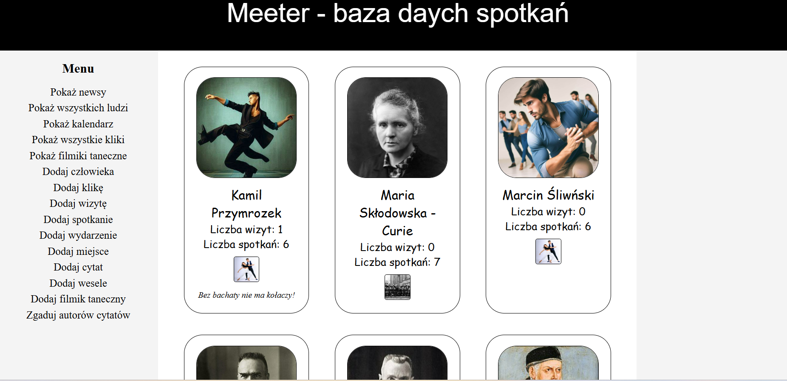
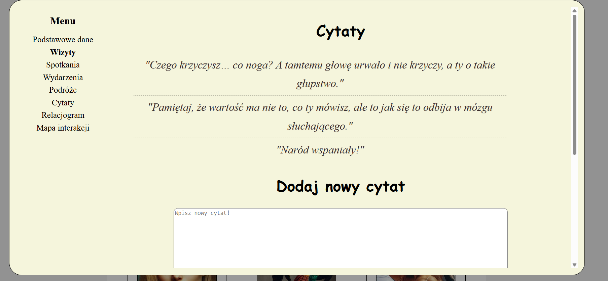
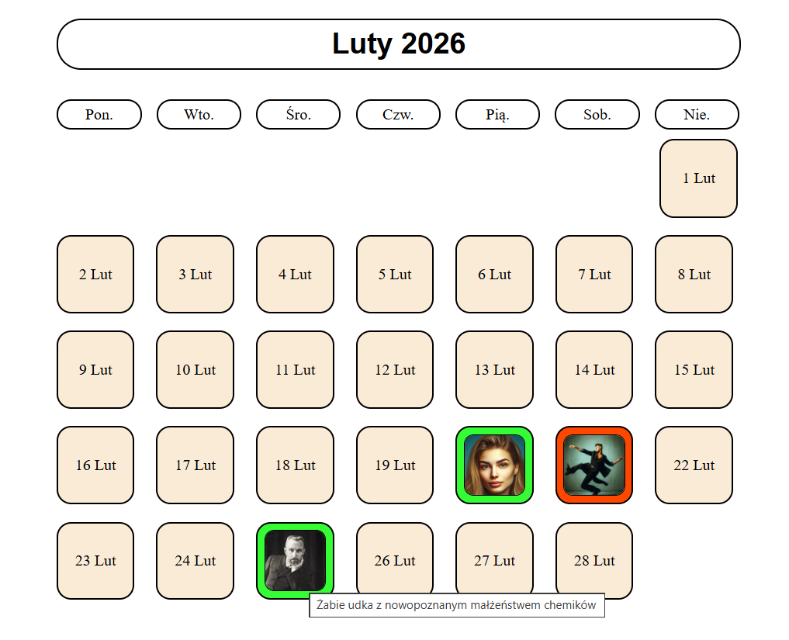
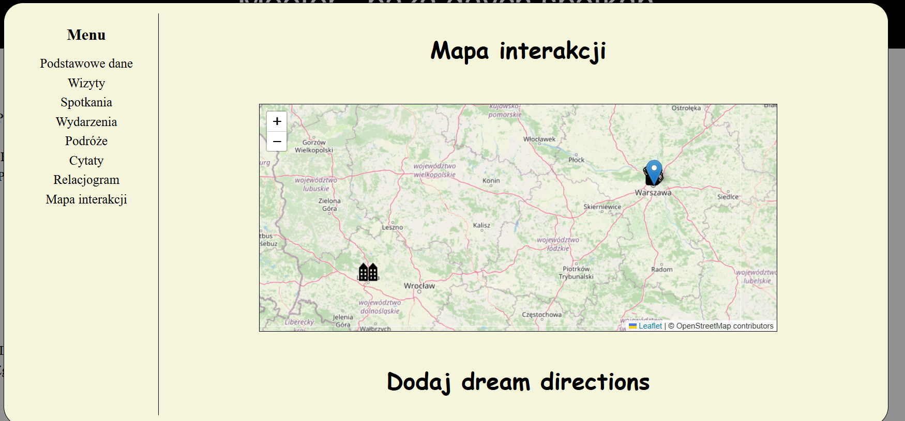
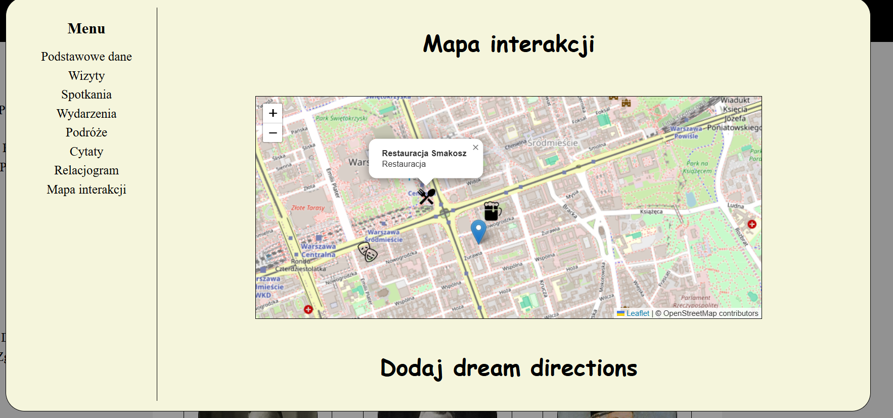

## Meeter — Social Interactions Tracker (React)

**Meeter** is a personal project developed iteratively since **Easter 2024**.  
The current React-based version represents the **third iteration** of the application.

The project focuses on **recording, organising, and exploring real-world social interactions**, combining a structured relational database with interactive UI views.  
It also serves as a personal sandbox for continuous development in **modern web application design**.

Earlier iterations were implemented in **pure (Vanilla) JavaScript**, providing a conceptual and technical foundation for the current architecture.

---

### Tech Stack

- Node.js
- React
- MySQL (relational database)
- Leaflet (map-based visualisation)
- Mock and real data (with planned anonymisation)

---

### Current Features (Mock Data)

Below are selected screenshots presenting the current state of the application using mock data.

---

#### AllHumans.jsx  
A central overview of all people stored in the database.  
This view serves as the main entry point for browsing and selecting individuals.

---

#### HumanModal.jsx — Basic Information  
A modal view presenting structured personal data for a selected individual.

---

#### Quotes Section  
The modal also contains a **Quotes** section, where quotes can be **added and browsed** for each person.

---

#### Calendar View — Visits & Meetings  
A calendar-based view used to **track visits and meetings over time**.

Each visit represents a single interaction stored in the database.

---

#### Map View — Location-Based Interactions (Leaflet)

Interactions are visualised on an **interactive map powered by Leaflet**.

Each meeting is represented by a marker corresponding to its **real-world location**  
(e.g. a meeting in Beijing appears in Beijing, while a meeting in a local bar is displayed at its actual location).

  

---

### Previous Iteration (Vanilla JavaScript)

A video presenting the **latest visualisation from the previous Vanilla JavaScript iteration** is available here:  
👉 https://youtu.be/D-qVszXLZdE

This version served as a conceptual and technical stepping stone toward the current React implementation.
